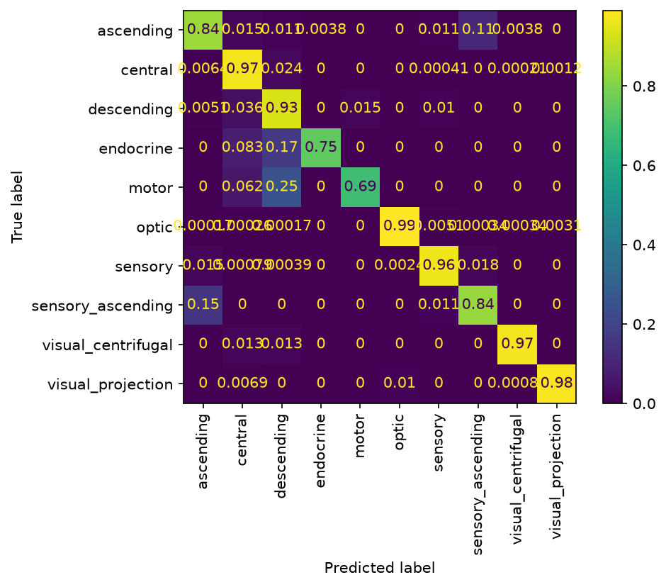
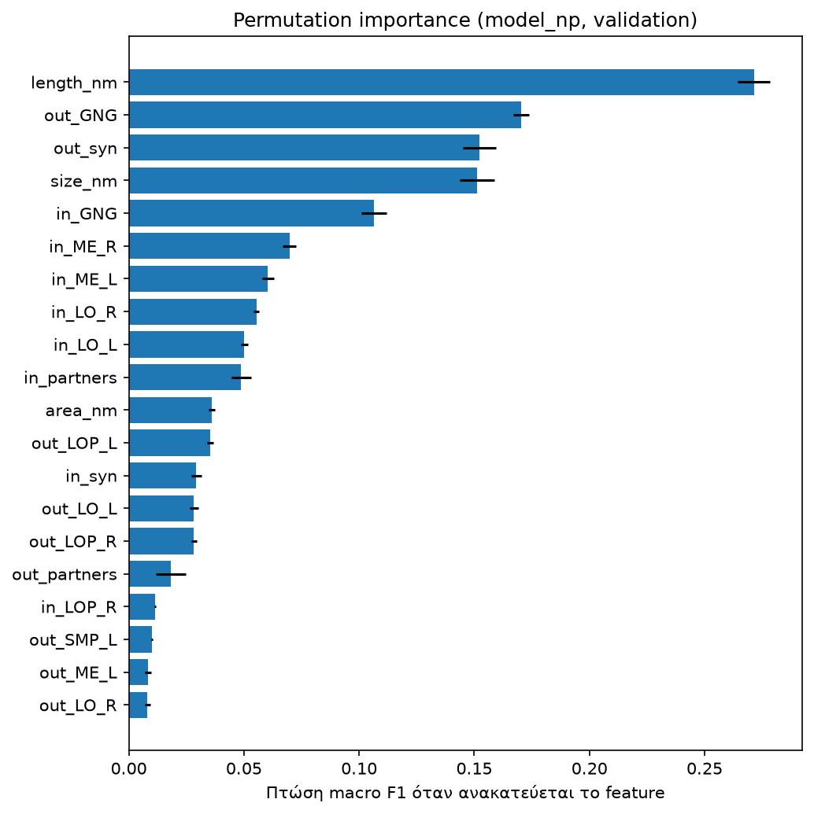

# Predicting Neuron Cell Types from Whole-Brain Connectivity

Classifying the neurons of the adult *Drosophila melanogaster* brain (FlyWire connectome) into their super-class, using only how each neuron is wired.

## 1. Goal

FlyWire assigns every neuron to one of 10 super-classes (e.g. `optic`, `central`, `sensory`, `descending`). The question is how much of this identity can be recovered from connectivity alone: how many partners and synapses a neuron has, which neurotransmitter its outputs use, how large it is, and in which brain regions it receives and sends synapses.

## 2. Data

FlyWire connectome, materialization **v783**, from the [FlyWire Codex](https://codex.flywire.ai). The data files are not in this repository. See [`data/README.md`](data/README.md) for the file list and column descriptions.

| File | Rows | Used for |
|---|---|---|
| `classification.csv.gz` | 139,255 | label (`super_class`) |
| `connections_princeton.csv.gz` | 5,342,446 | partners, synapses, neurotransmitters, neuropil features (one row = one pre→post pair within one neuropil) |
| `cell_stats.csv.gz` | 139,246 | size (length, area, volume) |

The 9 neurons missing from `cell_stats` were dropped, leaving **139,246 neurons**. The classes are very imbalanced:

| super_class | neurons | share |
|---|---:|---:|
| optic | 77,868 | 55.9% |
| central | 32,381 | 23.3% |
| sensory | 16,935 | 12.2% |
| visual_projection | 7,684 | 5.5% |
| ascending | 1,750 | 1.3% |
| descending | 1,305 | 0.9% |
| sensory_ascending | 612 | 0.4% |
| visual_centrifugal | 522 | 0.4% |
| motor | 109 | 0.08% |
| endocrine | 80 | 0.06% |

**Split:** stratified by `super_class`, 70 / 15 / 15: train 97,472, validation 20,887, test 20,887 (`random_state=42`). All model choices were made on the validation set. The test set was evaluated once, at the end.

## 3. Features

**(a) Basic features (13).**
- Number of input and output partners.
- Number of input and output synapses.
- Cell size: `length_nm`, `area_nm`, `size_nm`.
- Neurotransmitter mix of the outputs: the fraction of output synapses predicted as ACH, DA, GABA, GLUT, OCT and SER.

**(b) Neuropil features (158).** The connections table records the brain region (neuropil) of every connection, and there are 79 regions. For each neuron:
- `out_<region>` is the fraction of its output synapses that lie in that region.
- `in_<region>` is the fraction of its input synapses that lie in that region.

79 regions × 2 directions = 158 features. A neuron with no inputs (or no outputs) gets zeros. With the basic features, the total is 171.

- **Why fractions and not counts:** The absolute amount of connectivity is already in `in_syn` and `out_syn`. As counts, the region features would mostly repeat that information, and large neurons would dominate every region. As fractions, they describe only *where* a neuron connects, independent of *how much*.
- **Why separate in/out:** Many super-classes are defined by direction. A visual centrifugal neuron, for example, receives input in the central brain and sends output to the optic lobe. Merging inputs and outputs into one profile would erase exactly that distinction.

## 4. Models

- **Majority class** (always `optic`): reference point.
- **Logistic Regression** (baseline): features standardised with `StandardScaler`, `max_iter=1000`. Basic features only.
- **HistGradientBoostingClassifier:** `max_iter=1000`, default hyperparameters (not tuned). Trained once on the basic features, and once on basic + neuropil features.

Both models use `class_weight="balanced"`. This weights each class by the inverse of its frequency, so an error on an `endocrine` neuron (0.06% of the data) costs as much in total as an error on an `optic` one (56%). Without weights, an early boosting run reached higher accuracy (0.873) but a much lower balanced accuracy (0.524) and macro F1 (0.507). It was mostly predicting the large classes.

**Metrics:**
- **Macro F1:** the main metric. Every class counts equally.
- **Balanced accuracy:** mean recall per class.
- **Accuracy:** reported for completeness, but with 56% `optic` it says little about the rare classes.

## 5. Results

| Model | Features | Set | Accuracy | Balanced acc. | Macro F1 |
|---|---|---|---:|---:|---:|
| Majority class | none | validation | 0.56 | 0.10 | n/a |
| Logistic Regression | basic | validation | 0.683 | 0.676 | 0.374 |
| HistGradientBoosting | basic | validation | 0.830 | 0.711 | 0.564 |
| HistGradientBoosting | basic + neuropil | validation | 0.978 | 0.893 | 0.854 |
| **HistGradientBoosting** | **basic + neuropil** | **test** | **0.977** | **0.880** | **0.843** |

F1 per class:

| super_class | boosting, basic (val) | boosting + neuropil (val) | boosting + neuropil (test) | test support |
|---|---:|---:|---:|---:|
| optic | 0.92 | 0.99 | 0.99 | 11,680 |
| central | 0.78 | 0.98 | 0.98 | 4,857 |
| sensory | 0.91 | 0.97 | 0.97 | 2,541 |
| visual_projection | 0.59 | 0.97 | 0.97 | 1,152 |
| ascending | 0.51 | 0.78 | 0.79 | 262 |
| descending | 0.29 | 0.72 | 0.70 | 195 |
| sensory_ascending | 0.32 | 0.62 | 0.61 | 92 |
| visual_centrifugal | 0.23 | 0.94 | 0.92 | 79 |
| motor | 0.56 | 0.73 | 0.81 | 17 |
| endocrine | 0.52 | 0.82 | 0.70 | 12 |

Adding the neuropil features raised validation macro F1 from 0.564 to 0.854. The largest gain was `visual_centrifugal` (0.23 → 0.94). Validation and test scores are close, so the model does not appear to be overfit to the validation set.

Confusion matrix (validation, boosting + neuropil, rows normalised):



Permutation importance on the validation set (drop in macro F1 when a feature is shuffled, 5 repeats, top 20):



## 6. Interpretation

Before adding the neuropil features, I wrote down what I expected for the weakest classes. I then checked each expectation against per-class means on the training set.

- **Visual centrifugal: confirmed.**
  - Inputs come mostly from central-brain regions (IPS, SPS, PLP).
  - Outputs go to the optic lobe: LOP, LO and ME together account for 0.72 of output synapses on average.
- **Endocrine: confirmed.**
  - Fewest output synapses of any class (mean 15.2, median 5).
  - 41% of endocrine neurons have no output synapses in the brain at all.
- **Descending: partly confirmed.**
  - Inputs come from non-optic regions (GNG 0.42, then IPS, SAD, SPS).
  - They do not have few outputs in absolute terms: mean 677.5, slightly more than `central` (613.0).
  - They do have few outputs relative to their own inputs (mean in_syn 1932.5, i.e. about three times their outputs), whereas `central` neurons are roughly balanced.
- **Motor: partly confirmed.**
  - Fewer outputs than `central` or `descending` (mean 184.6, median 32).
  - But not "none": only 13% have zero output synapses, and most outputs lie in the GNG.

The data contain only synapses inside the brain. They show *that* these classes have few outputs there, not *where* the missing outputs go (ventral nerve cord, muscles, haemolymph).

## 7. Limitations

- **The label is partly defined by location.** FlyWire super-classes are assigned partly by where a neuron sits (for example, `optic` neurons are intrinsic to the optic lobe). For large classes such as `optic` and `central`, the neuropil features let the model partly rediscover the labelling rule, rather than learn something new about connectivity.
- **Very small classes.** The test set has only 12 `endocrine` and 17 `motor` neurons, so one or two errors move their F1 a lot. Their F1 is unstable: endocrine was 0.82 on validation and 0.70 on test.
- **sensory_ascending vs ascending.** On validation, 11% of `ascending` neurons are predicted as `sensory_ascending` and 15% the other way round.
  - Both classes have almost the same spatial profile: GNG is their main input and output region.
  - They differ mainly in output volume: mean out_syn 111.5 vs 831.5.
  - `sensory_ascending` has the lowest F1 of all classes (0.61 on test).
- **No tuning, one split.** Hyperparameters were left at their defaults, and all scores come from a single train/validation/test split, with no estimate of variance across splits.

## 8. Next steps

- A 3D visualisation of the brain with each neuron coloured by predicted vs. true super-class, to see where the errors are located.
- Predicting the finer `class` level of the FlyWire hierarchy.

## 9. How to run

Requires Python 3.11+. Everything runs on CPU. About 14 GB of RAM is enough.

```bash
git clone <repo-url>
cd fly-connectome
python -m venv .venv
.venv\Scripts\activate          # Windows
# source .venv/bin/activate     # macOS / Linux
pip install -r requirements.txt
```

Place the FlyWire `.csv.gz` files in `data/`, then run the notebooks in order:

| Notebook | What it does |
|---|---|
| [`00_data.ipynb`](notebooks/00_data.ipynb) | loads the tables, builds basic features, stratified split, then neuropil features. Writes `data/processed/` |
| [`01_baseline.ipynb`](notebooks/01_baseline.ipynb) | Logistic Regression baseline |
| [`02_boosting.ipynb`](notebooks/02_boosting.ipynb) | HistGradientBoosting (basic, then + neuropil), test evaluation, interpretation. Writes figures to `results/` |

## Data citation

- Dorkenwald, S., Matsliah, A., Sterling, A. R., et al. (2024). Neuronal wiring diagram of an adult brain. *Nature*, 634, 124–138. https://doi.org/10.1038/s41586-024-07558-y
- Schlegel, P., Yin, Y., Bates, A. S., et al. (2024). Whole-brain annotation and multi-connectome cell typing of *Drosophila*. *Nature*, 634, 139–152. https://doi.org/10.1038/s41586-024-07686-5
